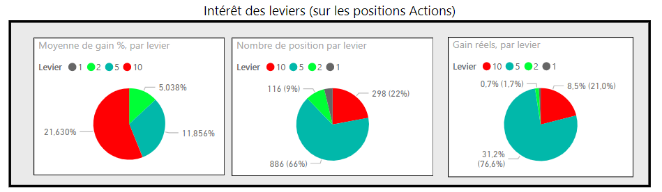
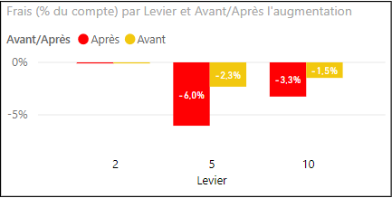
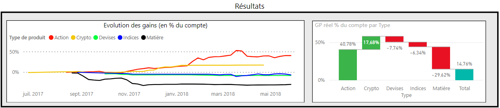

# Shampra - Bilan Etoro de juin 2018

Bonjour à tous ceux qui me suivent! 

Je fais ce point en français, n'hésitez pas à demander si Google Trad n'est pas à la hauteur! 

Je ne parle jamais de mon compte, je ne cherche pas à le "vendre" comme beaucoup ;-).   
Mais certains m'avaient demandé de faire un point suite à l'évolution des frais en janvier.  
J'ai aussi l'un de vous qui m'a demandé des infos sur ma surcouche Etoro.  
Et je vais en profiter enfin pour faire un point global après bientôt 1 an sur Etoro, pour  moi-même! 

## Bilan des leviers
_Pour répondre à la question "est-ce réellement intéressant d'utiliser un haut levier?"..._   
Ma moyenne de gain par position en X10 est de 20%, contre 11% en X5.  
Le gain réel (frais déduit) n'est aussi que de 20% alors que ces positions représentent 23% de mes positions.

Ces statistiques sont sur un an, l'intérêt a fortement diminué depuis janvier avec les frais largement augmenté d'Etoro... mais je continuerais, avec beaucoup plus de parcimonie!  
Actuellement, 5 positions en X10 : 2 > 100% de gain, 1 péniblement en vert et 1 en rouge qui revient de loin.

## Impact de l'augmentation des frais

En janvier, Etoro a significativement augmenté les frais. Drastiquement.  
Avant, conserver une position 1 an, levier X5 pour 100\$, coûtait 14\% en frais...  
Maintenant, la même position coûte 40\% par an!  
Cela nécessite vraiment de surperformer! En ces temps incertains, encore plus difficile... et un échec devient une double peine!  
C'est aussi visible sur les PI : **Wels3y** est un gros consommateur de frais, le plus gros chez moi.  
Actuellement, 5% de l'investissement placé sur lui sont partis en frais...  
PI : vous avez des frais réduits ou pas de frais, mais n'oubliez pas que nous si!

Côté statistiques, pas de surprises, ça a bien augmenté! Par contre levier X5 ou levier X10, pas de différence, c'est tout ou rien.    

Bilan : 
Je tiens à garder ma diversification!
Pour éviter les frais, il faudrait tout passer en X2 ou X1 et je n'ai pas assez de fond pour le faire sans nuire à cette diversité.  
Je vais simplement garder un oeil sur mes statistiques. Oh, et je n'ai plus ajouté de fonds sur Etoro depuis cette augmentation.

## Bilan activité

### Par type de produits
J'ai perdu beaucoup dans le pétrole, l'or et la devise USDJPY pendant mes premiers mois... -22%, rien que ça!  
La leçon a coûté cher, mais au moins je suis fier d'être de nouveau positif malgré cela!  

Je travaille pour revenir en positif sur les indices (suite grosse perte de 5% du compte en février), l'activité principale restant sur les actions US et EU.  

### Quelques extrêmes
Produit|% du compte|Mois
--|--|--
**SPX500**|-2,6%|Mars 
**MXL**|-2,7%|Mai 
**STM.MI**|-3%|Avril 

**MXL** a été vraiment douloureux...  
**STM.MI** encore plus, après avoir fermé plusieurs positions via le SL, j'ai fermé en rouge tout le reste... et l'action est repartie à la hausse aussitôt! Très énervant! Je suis ré-entré (actuellement à +30%) mais avec une somme moindre et ce qui est perdu est... perdu

|Produit|% du compte|Mois| 
|--|--|--| 
|MU|4,4%|Mars
|NFLX|2,8%|Janvier

Pleins de bonnes surprises, mais rare sont les pics supérieurs à +2%!  
**MU** est exceptionnel, difficile à tenir car cela passe par de longue périodes rouges, mais ça vaut le coup : de nouveau +2% gagné en Mai!

### Profils copiés  
Merci aux PI que je copie! Surtout ceux dans le vert...  
Début d'année difficile pour tous sans exception, surtout le mois de mars vraiment affreux.

J'ai ajouté **CatyFX** et **ALnayef** afin de diversifier (et pour leur régularité!), le début a été difficile mais tout est vert maintenant!

**Wels3y** reste très apprécié pour ses messages, rassurant en temps de crise et permettant parfois de prendre de bonnes positions.  
Et **AlexPlesk** pour sa régularité : même si là aussi 2018 a mal commencé, je ne m'inquiète vraiment pas pour ma copie!

## Améliorer l'utilisation
Pour information ["My Etoro"](https://shampra.github.io/myEtoro/) est un userscript qui rajoute des informations à Etoro.  
En vrac :
-   Bulle d'information sur chaque produit
-   Tag des produits (dans mon cas, l'action à faire et le type de produit, par exemple différencier marché US et marché EU)
-   Mise en valeur dans certains cas (rouge si à surveiller, date de l'ER en gras si c'est le lendemain,...)
-   Filtres et tri sur les favoris

Même si le script est prévu initialement uniquement pour moi et que peu de monde le suit, j'ai décidé de l'améliorer pour le rendre "diffusable".  
Je suis en train de le transformer en web-extensions, de l'internationaliser (enfin, traduction anglais et français mais une fois en place tout est possible :)) et de le rendre plus facilement configurable.  
Et y seront intégrés d'autres nouveautés que je n'ai pas pris le temps de publier sur Github. Donc oui, désolé, toujours pas de mise à jour mais ça viendra!
